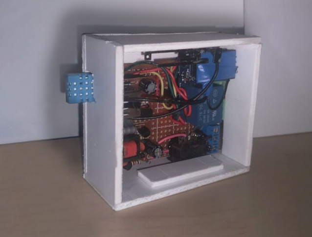

# miniTermo
 ### Arduino FAN relay on ESP-01S / DHT22 with webpage, ajax and GSAP animations

Smart thermostat controller made for controlling fan ower wifi.  

> **ArduinoOTA** 
> **Update values on all devices in realtime** 
> **DHT11**  used spare part - nead to replace.   

